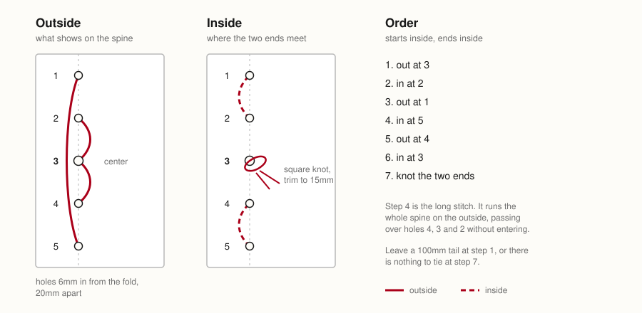
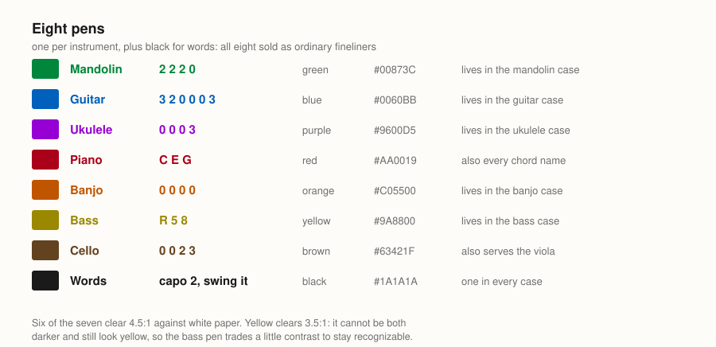

# Fancy Chords and Their Voicings

A pocket chord book you can print, cut up, and sew. Mandolin, guitar, ukulele, piano, banjo, bass, and cello. Every chord in all twelve keys.

| Edition | Read | Print | Pages | Sheets | |
|---|---|---|---|---|---|
| **Everything** | [Fancy Chords and Their Voicings.pdf](https://github.com/linenoise/voicings/blob/main/build/Fancy%20Chords%20and%20Their%20Voicings.pdf) | [Fancy Chords and Their Voicings (print).pdf](https://github.com/linenoise/voicings/blob/main/build/Fancy%20Chords%20and%20Their%20Voicings%20%28print%29.pdf) | 119 | 15 | All seven instruments |
| Mandolin | [Fancy Mandolin Chords and Their Voicings.pdf](https://github.com/linenoise/voicings/blob/main/build/Fancy%20Mandolin%20Chords%20and%20Their%20Voicings.pdf) | [Fancy Mandolin Chords and Their Voicings (print).pdf](https://github.com/linenoise/voicings/blob/main/build/Fancy%20Mandolin%20Chords%20and%20Their%20Voicings%20%28print%29.pdf) | 16 | 2 | Also fiddle / violin, tenor banjo |
| Guitar | [Fancy Guitar Chords and Their Voicings.pdf](https://github.com/linenoise/voicings/blob/main/build/Fancy%20Guitar%20Chords%20and%20Their%20Voicings.pdf) | [Fancy Guitar Chords and Their Voicings (print).pdf](https://github.com/linenoise/voicings/blob/main/build/Fancy%20Guitar%20Chords%20and%20Their%20Voicings%20%28print%29.pdf) | 16 | 2 | Also baritone ukulele |
| Ukulele | [Fancy Ukulele Chords and Their Voicings.pdf](https://github.com/linenoise/voicings/blob/main/build/Fancy%20Ukulele%20Chords%20and%20Their%20Voicings.pdf) | [Fancy Ukulele Chords and Their Voicings (print).pdf](https://github.com/linenoise/voicings/blob/main/build/Fancy%20Ukulele%20Chords%20and%20Their%20Voicings%20%28print%29.pdf) | 16 | 2 |  |
| Piano | [Fancy Piano Chords and Their Voicings.pdf](https://github.com/linenoise/voicings/blob/main/build/Fancy%20Piano%20Chords%20and%20Their%20Voicings.pdf) | [Fancy Piano Chords and Their Voicings (print).pdf](https://github.com/linenoise/voicings/blob/main/build/Fancy%20Piano%20Chords%20and%20Their%20Voicings%20%28print%29.pdf) | 27 | 4 |  |
| Banjo | [Fancy Banjo Chords and Their Voicings.pdf](https://github.com/linenoise/voicings/blob/main/build/Fancy%20Banjo%20Chords%20and%20Their%20Voicings.pdf) | [Fancy Banjo Chords and Their Voicings (print).pdf](https://github.com/linenoise/voicings/blob/main/build/Fancy%20Banjo%20Chords%20and%20Their%20Voicings%20%28print%29.pdf) | 16 | 2 | With drone spikes |
| Bass | [Fancy Bass Chords and Their Voicings.pdf](https://github.com/linenoise/voicings/blob/main/build/Fancy%20Bass%20Chords%20and%20Their%20Voicings.pdf) | [Fancy Bass Chords and Their Voicings (print).pdf](https://github.com/linenoise/voicings/blob/main/build/Fancy%20Bass%20Chords%20and%20Their%20Voicings%20%28print%29.pdf) | 8 | 1 | Roots and patterns |
| Cello | [Fancy Cello Chords and Their Voicings.pdf](https://github.com/linenoise/voicings/blob/main/build/Fancy%20Cello%20Chords%20and%20Their%20Voicings.pdf) | [Fancy Cello Chords and Their Voicings (print).pdf](https://github.com/linenoise/voicings/blob/main/build/Fancy%20Cello%20Chords%20and%20Their%20Voicings%20%28print%29.pdf) | 20 | 3 | Roots, patterns and chords; also viola |

The contents of these PDFs are based on an actual handwritten notebook with thousands of chord voicings that I've kept in my instrument cases for years. Photos of the pages of that original notebook are included under the `notebook/` folder of this repository.

**Read** is a PDF of each page enlarged to full-page for reading on a screen or reader.

**Print** is the same book imposed 4-up on US Letter, four 3.5in x 5.5in pages to a sheet, for printing and sewing. Those files carry `(print)` in the name.

Per-instrument editions carry that instrument's circle of fifths, its reference pages, its chords, and the credits.

This QR code is the same as the QR code on the front of the printed books. It brings you to this book repository, <http://github.com/linenoise/voicings>. This allows you to **share this book with friends**:


## How to print, cut, and sew or staple a copy

1. Print the 4-up PDF on US Letter, **double-sided, flipped on the long edge**, at 100%. Don't let the printer "fit to page".
2. Cut along the gray lines. Every sheet carries them: three down and one across, marking the four 3.5in x 5.5in rectangles. That is 3/4in of waste trimmed from each side, one cut down the middle and one across. Two pages tall is exactly 11in, so there is no waste top or bottom and no line to cut there.
3. Stack the rectangles in the order they came off the sheet: top-left. top-right, bottom-left, bottom-right.
4. Punch the five holes. Every page carries five small gray circles down its binding edge, so there is nothing to measure: square up the stack, punch through the marks, sew.
5. Sew a five-hole pamphlet stitch. The inner margin is 8.5mm, which leaves room for the thread. Alternatively, staple the binding on the side with hole punch marks.



**Sewing the binding:** Work the passes in the order shown. The fourth is the only long one: it runs the whole spine on the outside, passing over three holes without entering them. Both ends finish inside at the center hole, where they knot to each other and get trimmed. Waxed linen thread holds better than cotton and does not need a second pass.

An office hole punch will not do this. It makes a 6mm hole, reaches about 12mm in, and has its own fixed spacing. Use an awl, a pin vise, or a 1.5mm bookbinding screw punch: the printed circles are 1.5mm across, sized to be covered by the hole rather than to survive beside it.

Holes 1, 3 and 5 sit where a three-ring binder punches, scaled to the page. A binder works on an 11in sheet: holes 4.25in apart, half an inch in. Those same ratios on a 3.5in by 5.5in page put the marks 15.9mm, 69.9mm and 123.8mm down, 5.2mm from the fold. Holes 2 and 4 fall halfway between, so all four gaps come out at 27mm and the set reads as evenly spaced.

The marks are on the binding edge, which alternates sides, so on a sheet printed both ways the front mark and the back mark land on the same spot. Punch once and both faces line up.

Both editions carry the same five marks. The print edition is an imposition of the screen pages rather than a separate typesetting, so whatever is on a screen page is on the printed one. To sew a three-hole pamphlet stitch instead, use holes 1, 3 and 5 and ignore the other two.

Consecutive pages land on the two faces of each rectangle, so the stack collates with no folding. `make print SCHEME=saddle` gives folded signatures instead.

The cut lines are a third of a point of mid gray, drawn by `tools/impose.py` rather than by `pdfpages`, whose own frame option is a black hairline with no way to soften it. Gray is enough to follow with scissors and faint enough that whatever survives the cut does not read as a border. `CROP_MARKS=1` adds the pdfpages frame on top, for anyone trimming with a guillotine who wants the harder edge.

The pages run right to the top and bottom edges of the paper. That's fine: the book's own margins are 6mm and 5mm, and a typical laser printer reserves about 4.2mm. A Brother HL-2270DW does. Nothing gets clipped as long as the driver isn't scaling.

## How to recompile the PDF yourself

```bash
make
```

Validates the data and builds all fourteen PDFs. You need Python 3 with PyYAML, and XeLaTeX for the PDFs. The Makefile finds MacTeX and BasicTeX on its own. Poppler or Ghostscript is optional, for counting pages.

```bash
brew install --cask basictex          # macOS
sudo apt install texlive-xetex texlive-latex-extra   # Debian
```

| Target | Does |
|---|---|
| `make` | Validate, then build every edition |
| `make validate` | Check every voicing against the chord it names |
| `make repair` | Propose fixes for anything that fails (`APPLY=1` writes them) |
| `make complete` | Fill every instrument out to the full vocabulary (`APPLY=1`) |
| `make piano` | Regenerate the piano pages from the shape table |
| `make spikes` | Regenerate the banjo drone positions |
| `make lint` / `make pagecheck` | Catch undefined macros; catch page overflow |
| `make clean` / `make distclean` | Remove TeX debris; remove all of `build/` |

## How the data is checked

Every voicing is checked against the chord it claims to be. `tools/theory.py` knows what notes are in each chord. `tools/validate.py` works out what a fingering actually sounds on that tuning, and compares.

- **Error:** sounds a note outside the chord. Fails the build.
- **Warning:** every note belongs, but a defining tone is missing. A mandolin chop chord drops the fifth on purpose. Allowed.

**2,658 voicings, 0 errors, 232 warnings.**

Two of those warnings reach the page as superscripts, because a player needs to know:

- **r** for rootless. A five-note chord will not fit on four strings, so the root goes and the bass covers it. Fine for rhythm, wrong for soloing.
- **i** for inversion. The named bass note is in the chord but not underneath it. Only three of these are left: `generate.py` now treats a named bass as binding, and falls back to an inversion only where the instrument genuinely cannot reach. All three are mandolin shapes from the notebook, kept as played.

When a voicing failed, `tools/repair.py` looked for the nearest playable fingering that does spell the chord, preferring the fewest strings moved. Everything it changed is in [CORRECTIONS.md](CORRECTIONS.md), with the notebook's value beside the printed one. The search stops as soon as the chord is fully spelled: a two-string fix that turns `Gm` into a bare `G5` is worse than a three-string one that sounds the flat third.

Six entries couldn't be repaired. Those were either dropped in favor of another voicing of the same chord or replaced with a generated shape. They're listed at the end of `CORRECTIONS.md`.

Provenance lives in `data/notebook-source.yaml`, which is frozen. It used to be a flag on each entry, but that kept getting stripped, and stale generated shapes then survived rounds of improvement without anyone noticing. `tools/provenance.py --sync` rebuilds the flags from the record.

## Playability

Four fingers, with a barre counting as one. That only holds if no open string lies under it, since the barre would stop that string too. Reach is per instrument: a mandolin's twelfth fret sits where a guitar's seventh does.

Reach isn't one number. `1-3-5-7` is an ordinary diminished shape on a mandolin: one finger per string, climbing two frets at a time. The same span with the frets jumbled is unplayable. So a diagonal gets a longer allowance than a shape that asks two fingers to share a string pair.

`tools/checkgen.py` scores the generator against the notebook: for every chord a person voiced by hand, it asks the generator for the same chord and compares. The generator picks something harder about 1% of the time.

## The chord vocabulary

`theory.VOCABULARY` is everything the mandolin pages, the piano worksheet, and the core worship voicings use between them. `make complete` gives every instrument all of it in all twelve keys. Transcribed voicings are left exactly as written. Missing ones are generated. Slash voicings on the ukulele are inversions, because it's re-entrant and has no bass.

**Power chords** are built, not searched for. The ranked search wants as many strings ringing as a chord can fill and a 5 chord is deliberately the opposite: three strings, the rest damped, rooted on one of the two lowest. Asking the search for C5 gave `x3x013`, which sounds the right two notes and is not what anyone plays. `generate.power_chord` returns `x355xx`.

**Rooted variants.** Where the first voicing is not in root position, guitar prints a second one that is. The search treats the root in the bass as a preference, which is right and keeps `Gb7#5` out of the eleventh fret, but the shape it settles on is sometimes not the one anyone plays: C9 came out `010010` when the shape a guitarist means by C9 is `x30310`. Both are printed. The open one is easier, the rooted one is movable, and which you want depends on what you are playing. Turned on per instrument with `root_variants` in `instruments.yaml`.

Guitar carries five more: `11`, `13`, `m13`, `maj13`, `7#11`, listed in `instruments.yaml` as `extra_vocabulary`. Six strings can spell a six-note chord; four courses would drop half of it and keep the name. These generate with the root in the bass, because without that the ranking finds the cheapest correct shape rather than the one a guitarist plays: `G13` came out as six open strings and a finger.

**Spelling.** Notes are spelled by function: the augmented fifth of `C+` is G#, not Ab. Three semitones above C is the flat third of `Cm9` and the sharp ninth of `C7#9`. `theory.DEGREE_MAP` carries this per quality. The piano pages are the exception, in both directions. They name the key you actually play, `A` rather than `Bbb`, because nobody hunts a keyboard for a double flat, and the generated spread voicings follow the same rule as the transcribed close ones: flat keys spelled with flats, sharp keys with
sharps, so a row never gives one note two names. They also run one column to a page, two pages to a key, so no voicing ever wraps.

**Degrees** are written accidental first: `b3`, `b7`, `#5`, matching how chord symbols spell them.

## Layout

One LaTeX page is one notebook page, 3.5in x 5.5in. `tex/voicings.cls` owns geometry and type; `tools/render.py` owns what goes where.

The body is 12pt sans, two columns on the chord pages. That's the largest size at which nothing overflows, found by building at each size and checking. In two columns the binding constraint is width, not height: a nine-character name beside a six-character fingering is all a 36mm column takes, so the name sets one size down and the fingering stays full size.

Rows per page are tuned against the compiled PDF, not guessed: `tools/pagecheck.py` compares intended pages against what TeX produced and fails on overflow. `tools/editions.py` runs the same check on all fourteen.

## The color palette

**Each instrument has its own pen**. These are not arbitrary. They are colors you can walk into a store and buy an ink pen in, which matters if you write voicings for more than one instrument onto the same sheet of music. The blue pen lives in the guitar case, the green one in the mandolin case, the orange one in the banjo case. Red and black are the two you want everywhere, so they get distributed: red for note and chord names, black for words. Piano shares the red, since a piano voicing is spelled with note names anyway.



The constraint on the seven is that they be legible on white paper and, more importantly, distinguishable from each other at a glance: you should know which instrument a page belongs to before you have read a word of it.

One thing worth knowing before you print: matched contrast is exactly what makes colors indistinguishable in grayscale. On a mono laser printer all six land on nearly the same gray. The color coding works on screen or off a color printer; in mono, the heading on each page still names the instrument.

## Layout of the repository

```
data/
  instruments.yaml       tunings, reach limits
  notebook-source.yaml   frozen record of what the paper held
  banjo-spikes.yaml      generated by tools/spikes.py
  bass-patterns.yaml     root map and arpeggio patterns
  piano-shapes.yaml      piano voicings as interval patterns
  voicings/              one file per instrument
tools/
  theory.py              pitch classes, chord formulas, fret arithmetic
  playability.py         can a hand make this shape?
  validate.py            does each voicing spell its chord?
  repair.py resolve.py   fix what doesn't; drop or regenerate the rest
  generate.py complete.py  canonical voicings; full vocabulary
  piano.py spikes.py     generated sections
  render.py              data to LaTeX
  impose.py editions.py  page order; all fourteen PDFs
  checkgen.py            score the generator against the notebook
  provenance.py revert.py  what came off the paper; replay corrections
tex/                     the document class and its entry points
(notebook/)              photographs -- NOT in version control; the inside
                         cover carries a home address
```

## Adding an instrument

1. Add its tuning to `data/instruments.yaml`, 
2. Add `data/voicings/<instrument>.yaml` in the same shape as the others, then
3. Run `make validate`. 
4. Add it to `CHART_INSTRUMENTS` in `tools/render.py` for a circle of fifths. 

An instrument whose voicings are note names rather than frets sets `kind: notes`.

## Credits

Danne Stayskal, <danne@stayskal.com>, <http://danne.stayskal.com/>

MIT licensed. See [LICENSE.md](LICENSE.md).
